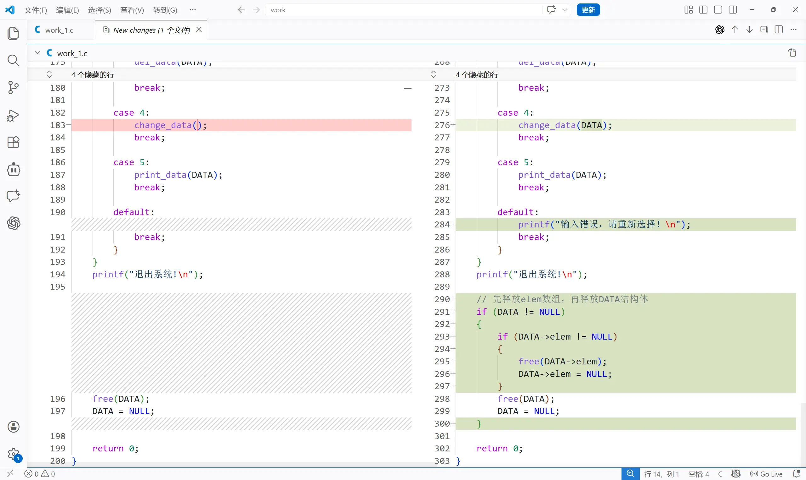
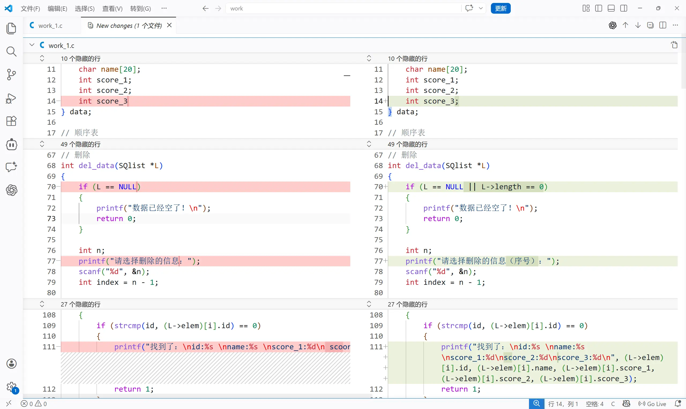

## 顺序表实现学生成绩管理

### AI交流记录

Q:
```docx
@/work_1.c 
当前项目基于C语言使用顺序表的方法建造一个学生成绩管理系统，检查其内容，完善change_data()函数，并指出其存在哪些bug及需要修改的地方
```
A:
一、原代码存在的 Bug 及问题

1. 语法错误
- **第14行缺少分号**：`int score_3` 后面缺少 `;`，导致编译错误。

2. `change_data()` 函数缺失
- **第183行**调用了 `change_data()`，但整个文件中根本没有定义该函数，导致链接错误。

3. `main()` 中 `change_data()` 调用缺少参数
- 即使定义了 `change_data()`，第183行 `change_data();` 也没有传入 `SQlist *L` 参数。

4. 内存分配错误
- **第137行**：`SQlist *DATA = (SQlist*)malloc(sizeof(SQlist)*50);` 分配了 50 个 `SQlist` 结构体的空间，但只需要 1 个。正确应为 `malloc(sizeof(SQlist))`。这导致内存浪费且逻辑错误。

5. 内存泄漏
- **第196行**：`free(DATA);` 只释放了 `SQlist` 结构体本身，但没有释放其内部的 `elem` 数组（通过 `init_list` 中 `malloc` 分配的），造成内存泄漏。

6. 菜单循环逻辑问题
- 菜单只显示一次，且 `scanf` 在 `while` 循环**之前**，导致用户只能选择一次操作，无法持续交互。
- 菜单应放在循环内部，每次操作后重新显示。

7. 添加数据时的提示文字错误
- **第166-168行**：三个成绩的提示都写成了 `"成绩1:"`，应分别为 `"成绩1:"`、`"成绩2:"`、`"成绩3:"`。

8. 添加位置逻辑错误
- 用户输入位置 `pos` 后，直接传给 `insert_at(DATA, pos, add)`，但 `insert_at` 的 `index` 参数是从 0 开始的，而用户输入是从 1 开始的，应转换为 `pos - 1`。

9. `scanf` 参数错误
- **第161-163行**：`scanf("%s", &(add.id))` 中，数组名 `add.id` 本身就是地址，不需要取地址符 `&`。虽然在某些编译器上不会报错，但不符合规范。同理 `add.name`。

10. `del_data()` 空指针检查不完整
- 第70行只检查了 `L == NULL`，但未检查 `L->length == 0`，当表为空时仍会执行后续逻辑。

11. `print_data()` 缺少返回值
- 第132行函数结束处没有 `return` 语句，但函数声明为 `int` 类型。

12. `print_data()` 和 `search_data()` 输出格式问题
- 输出中 `score_2` 和 `score_3` 前面有多余空格（`" scoore_2"` 和 `" score_3"`），且 `score_2` 拼写为 `scoore_2`（多了一个 o）。

13. 缺少 `case 1` 的作用域括号
- 在 `case 1` 中声明了变量 `int pos` 和 `data add`，但在 C89/C99 标准中，`switch` 的 `case` 中声明变量需要用 `{}` 括起来，否则可能编译报错。

---

二、`change_data()` 函数实现说明

完善后的 `change_data()` 函数功能：
1. 检查顺序表是否为空
2. 通过学号查找要修改的学生
3. 显示当前学生信息
4. 提供子菜单让用户选择要修改的字段（姓名、成绩1、成绩2、成绩3）
5. 支持多次修改不同字段，直到用户选择返回
6. 修改后直接更新顺序表中的数据

---

三、其他改进

- 将菜单显示和 `scanf` 移入 `while` 循环内部，实现持续交互
- 添加了 `init_list` 和 `malloc` 的失败检查
- 完善了内存释放逻辑（先释放 `elem` 数组，再释放 `DATA` 结构体）
- 添加了操作成功/失败的提示信息



### 项目源码
```c
/******************     顺序表实现学生成绩管理系统 *******************/

#include <stdio.h>
#include <stdlib.h>
#include <string.h>

// 数据元素
typedef struct
{
    char id[20];
    char name[20];
    int score_1;
    int score_2;
    int score_3;
} data;

// 顺序表
typedef struct
{
    data *elem;
    int length;
    int capacity;
} SQlist;

// 初始化
int init_list(SQlist *L)
{
    L->elem = (data *)malloc(sizeof(data) * 10);
    if (L->elem == NULL)
        return 0; // 内存申请失败
    L->length = 0;
    L->capacity = 10;
    return 1;
}

// 尾部插入
// int push_back(SQlist *L, data new_data)
// {
//     if (L->length >= L->capacity)
//     {
//         printf("数据满了！\n");
//         return 0;
//     }
//     L->elem[L->length] = new_data;
//     L->length++;
//     return 1;
// }

// 指定位置插入
int insert_at(SQlist *L, int index, data new_data)
{
    if (index < 0 || index > L->length)
        return 0; // 位置非法
    if (L->length >= L->capacity)
        return 0; // 数据满了

    // 将插入位置后面的元素从最后一个元素开始向后移，为将要插入的位置腾出空间
    for (int i = L->length; i > index; i--)
    {
        L->elem[i] = L->elem[i - 1];
    }
    L->elem[index] = new_data;
    L->length++;
    return 1;
}


// 删除
int del_data(SQlist *L)
{
    if (L == NULL || L->length == 0)
    {
        printf("数据已经空了！\n");
        return 0;
    }
    int n;
    printf("请选择删除的信息（序号）：");
    scanf("%d", &n);
    int index = n - 1;
    if (index < 0 || index > L->length - 1)
    {
        printf("选择错误！\n");
        return 0;
    }
    for (int i = index; i + 1 < L->length; i++)
    {
        L->elem[i] = L->elem[i + 1];
    }
    L->length--;
    printf("删除成功！\n");
    return 1;
}

// 查找信息
int search_data(SQlist *L)
{
    if (L == NULL || L->length == 0)
    {
        printf("数据为空！");
        return 0;
    }
    char id[20];
    printf("请输入学号：\n");
    scanf("%s", id);
    for (int i = 0; i < L->length; i++)
    {
        if (strcmp(id, (L->elem)[i].id) == 0)
        {
            printf("找到了：\nid:%s \nname:%s \nscore_1:%d\nscore_2:%d\nscore_3:%d\n", (L->elem)[i].id, (L->elem)[i].name, (L->elem)[i].score_1, (L->elem)[i].score_2, (L->elem)[i].score_3);
            return 1;
        }
    }
    printf("没找到！\n");
    return 0;
}

// 修改信息
int change_data(SQlist *L)
{
    if (L == NULL || L->length == 0)
    {
        printf("数据为空！\n");
        return 0;
    }

    char id[20];
    printf("请输入要修改的学号：\n");
    scanf("%s", id);
    int found = -1;
    for (int i = 0; i < L->length; i++)
    {
        if (strcmp(id, (L->elem)[i].id) == 0)
        {
            found = i;
            break;
        }
    }

    if (found == -1)
    {
        printf("没找到该学生！\n");
        return 0;
    }

    printf("当前学生信息：\n");
    printf("id:%s name:%s score_1:%d score_2:%d score_3:%d\n",
           L->elem[found].id, L->elem[found].name,
           L->elem[found].score_1, L->elem[found].score_2, L->elem[found].score_3);

    int choice = 0;
    while (1)
    {
        printf("\n请选择要修改的字段：\n");
        printf("1.姓名  2.成绩1  3.成绩2  4.成绩3  0.返回\n");
        scanf("%d", &choice);

        switch (choice)
        {
        case 1:
            printf("请输入新的姓名：\n");
            scanf("%s", L->elem[found].name);
            printf("修改成功！\n");
            break;
        case 2:
            printf("请输入新的成绩1：\n");
            scanf("%d", &(L->elem[found].score_1));
            printf("修改成功！\n");
            break;
        case 3:
            printf("请输入新的成绩2：\n");
            scanf("%d", &(L->elem[found].score_2));
            printf("修改成功！\n");
            break;
        case 4:
            printf("请输入新的成绩3：\n");
            scanf("%d", &(L->elem[found].score_3));
            printf("修改成功！\n");
            break;
        case 0:
            return 1;
        default:
            printf("输入错误，请重新选择！\n");
            break;
        }
    }
}

  
// 显示当前信息
int print_data(SQlist *L)
{
    if (L == NULL || L->length == 0)
    {
        printf("信息为空！\n");
        return 0;
    }
    for (int i = 0; i < L->length; i++)
    {
        printf("第%d个学生：\n", i + 1);
        printf("id:%s \nname:%s \nscore_1:%d\nscore_2:%d\nscore_3:%d\n", (L->elem)[i].id, (L->elem)[i].name, (L->elem)[i].score_1, (L->elem)[i].score_2, (L->elem)[i].score_3);
        printf("\n");
    }
    return 1;
}

int main()
{
    // 动态创建数据表
    SQlist *DATA = (SQlist *)malloc(sizeof(SQlist));
    if (DATA == NULL)
    {
        printf("内存申请失败！\n");
        return 0;
    }

    // 初始化
    if (init_list(DATA) == 0)
    {
        printf("内存申请失败！\n");
        free(DATA);
        return 0;
    }
  
    int select = 0;
    while (1)
    {
        printf("\n********** 1.增添信息   2.删除信息 ********\n");
        printf("********** 3.查找信息   4.修改信息 ********\n");
        printf("********** 5.查看信息   0.退出系统 ********\n");
        printf("请选择：");
        scanf("%d", &select);

        if (select == 0)
            break;
        switch (select)
        {
        case 1:
        {
            int pos;
            printf("添加位置（第几个位置）：\n");
            scanf("%d", &pos);
            data add;
            printf("添加数据：\n");
            printf("学号：\n");
            scanf("%s", add.id);
            printf("姓名：\n");
            scanf("%s", add.name);
            printf("成绩1:\n");
            scanf("%d", &(add.score_1));
            printf("成绩2:\n");
            scanf("%d", &(add.score_2));
            printf("成绩3:\n");
            scanf("%d", &(add.score_3));

            if (insert_at(DATA, pos - 1, add) == 0)
                printf("添加失败！\n");
            else
                printf("添加成功！\n");
            break;
        }

        case 2:
            del_data(DATA);
            break;
        case 3:
            search_data(DATA);
            break;
        case 4:
            change_data(DATA);
            break;
        case 5:
            print_data(DATA);
            break;
        default:
            printf("输入错误，请重新选择！\n");
            break;
        }
    }
    printf("退出系统!\n");

    // 先释放elem数组，再释放DATA结构体
    if (DATA != NULL)
    {
        if (DATA->elem != NULL)
        {
            free(DATA->elem);
            DATA->elem = NULL;
        }
        free(DATA);
        DATA = NULL;
    }
    return 0;
}
```
